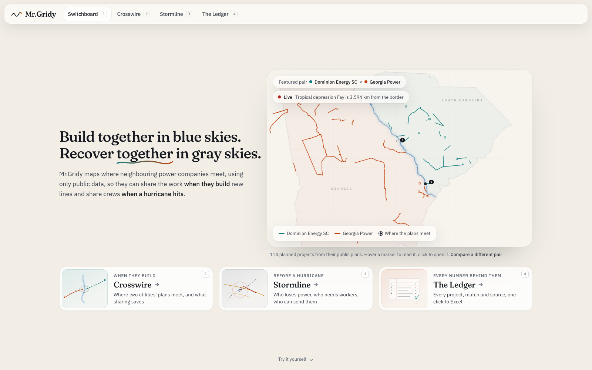

# Mr.Gridy

**Build together in blue skies. Recover together in gray skies.**

🌐 **Live: [mrgridy.miami](https://mrgridy.miami)**



Neighbouring utilities plan alone and pay twice. Mr.Gridy finds where their power line projects overlap, and when a hurricane hits, predicts the damage and shows who should send crews where.

Built at **ShellHacks 2026** for the **Sperry Tech GridLock Challenge**. The featured pair is Dominion Energy South Carolina (DESC) and Georgia Power (GPC), two utilities that face each other across the Savannah River.

---

## What it does

### 🗺️ Crosswire: where the plans cross
- Puts both utilities' **public** construction plans on one map and one calendar.
- Flags project pairs by closest-point distance in four tiers (**crossing, 1.6 km, 8 km, 40 km**), each with what the two could share.
- Adds **build-window overlap**, ranks every match, labels each one **robust** or **uncertain**, and suggests a shared staging yard.
- **DESC vs Georgia Power:** 114 projects, 2,580 pairs compared, **50 overlaps**, including **2 lines that physically cross**.
- **Any utility:** type a name and the Gemini agent finds its public plan, reads the PDF and maps every project. CEII documents are refused.

### 🌀 Stormline: where the next storm meets both grids
- Replays **14 real hurricanes** (Helene, Matthew, Ian, Florence and more).
- Predicts which of **~63,000 one-km line sections** break, using engineering failure curves for poles, towers and falling trees, with **10,000 GPU Monte Carlo runs** per storm.
- Builds repair zones that prioritize vulnerable residents, picks shared staging yards and shows **who should lend crews to whom**.
- Shows real outages hour by hour (DOE EAGLE-I) next to the model, plus a **live National Hurricane Center watch**.

### 📒 The Ledger
Every project, overlap and source in one table, with links to the original filings. One click exports to **Excel**.

### 🎙️ Ask Mr.Gridy
A voice agent with **28 tools** that control the app. Just ask, and it opens storms, plays replays, zooms to matches and checks funding, answering only from real data.

---

## Tech stack

| Layer | Tools |
|---|---|
| Web app | Next.js 16, React 19, TypeScript, Tailwind, MapLibre, deck.gl, three.js |
| Pipeline | Python, Shapely, scikit-learn, PyTorch (CUDA) |
| AI | **Google Gemini**: plan finder, PDF reading, grant checks, memos, agent LLM |
| Voice | **ElevenLabs**: Conversational AI agents, Text to Dialogue, multilingual TTS (EN/ES) |
| Database | **Tiger Data** (TimescaleDB): outage hypertables, `time_bucket` continuous aggregate |
| Hosting | **DigitalOcean App Platform** |

---

## Repository layout

```
src/               Next.js app (App Router)
src/lib/types.ts   data contract shared by the app and the pipeline
public/data/       JSON produced by the pipeline and read by the app
public/audio/      pre-generated voice briefings
pipeline/          Python pipeline: public filings and storm data -> public/data
scripts/           ElevenLabs agent setup and audio pre-generation
.do/app.yaml       DigitalOcean App Platform spec
```

## Run the app

```bash
npm install
cp .env.example .env.local   # add your keys
npm run dev
```

| Variable | Used for |
|---|---|
| `GEMINI_API_KEY` | utility finder, memos, grant checks |
| `ELEVENLABS_API_KEY` | voice agent and audio |
| `ELEVENLABS_AGENT_ID`, `ELEVENLABS_CROSSWIRE_AGENT_ID` | the two Ask Mr.Gridy agents (`scripts/create-agent.mjs`) |
| `TIGER_DATABASE_URL` | live outage charts and saved utilities |

The app still runs without keys: the AI features fall back to templates and the charts fall back to static data.

## Run the pipeline

```bash
python3 -m venv .venv && source .venv/bin/activate
pip install -r pipeline/requirements.txt
cd pipeline
python scripts/fetch_data.py
```

Storm simulations run on a GPU (`pipeline/requirements-gpu.txt`, see `pipeline/scripts/runpod.sh`):

```bash
python -m gridsight.response.simulate --storm all --device cuda --sims 10000
python -m gridsight.response.build --storm all --skip-sim
python -m gridsight.response.outage_cost
```

Raw documents are downloaded outside the repo (`../gridsight-data/raw`, override with `GRIDSIGHT_RAW`).

---

## Data sources

All public. No CEII.

- Dominion Energy South Carolina, Planned Transmission Projects $2M and above, 2026–2030 (SCRTP)
- Southeastern Regional Transmission Planning (SERTP), 2026 preliminary 10-year expansion plan
- Georgia Power public transmission project pages
- NOAA HURDAT2 and National Hurricane Center
- DOE / ORNL EAGLE-I outage data
- OpenStreetMap, HIFLD (archived), USFS tree canopy
- HHS emPOWER
